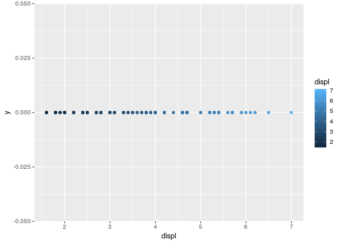
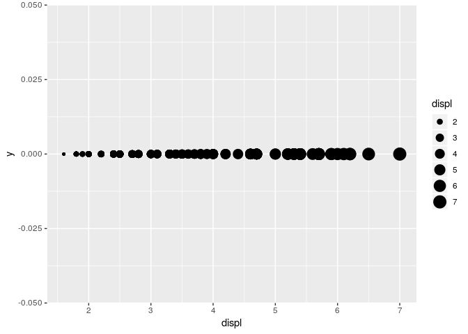
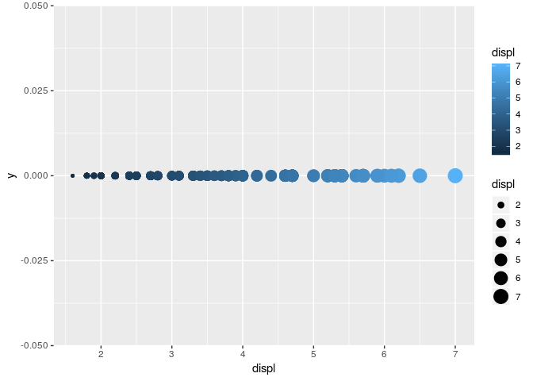
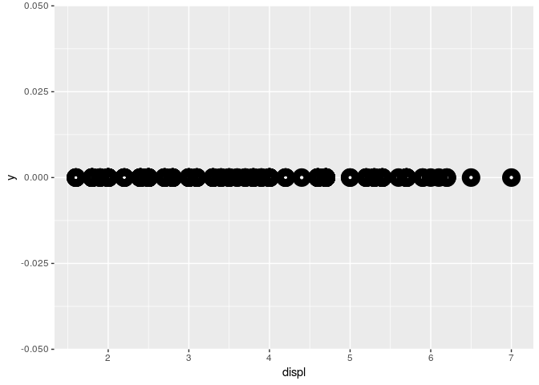
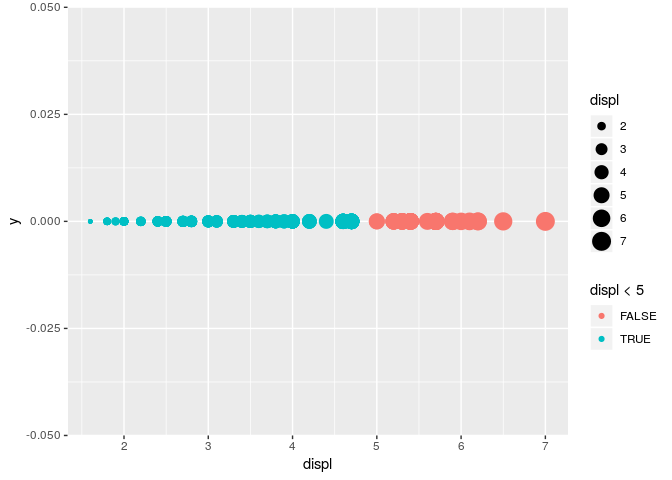

Homework 1: ggplot2
================
Your Name
2019-03-04

``` r
library(ggplot2)
install.packages("tidyverse")
```

    ## Installing package into '/home/rstudio-user/R/x86_64-pc-linux-gnu-library/3.5'
    ## (as 'lib' is unspecified)

``` r
library(tidyverse)
```

    ## ── Attaching packages ───────────────────────────────────────────────────── tidyverse 1.2.1 ──

    ## ✔ tibble  2.0.1       ✔ purrr   0.3.1  
    ## ✔ tidyr   0.8.3       ✔ dplyr   0.8.0.1
    ## ✔ readr   1.3.1       ✔ stringr 1.4.0  
    ## ✔ tibble  2.0.1       ✔ forcats 0.4.0

    ## ── Conflicts ──────────────────────────────────────────────────────── tidyverse_conflicts() ──
    ## ✖ dplyr::filter() masks stats::filter()
    ## ✖ dplyr::lag()    masks stats::lag()

By using *mpg* dataset:

1.  Map a continuous variable to color, size, and shape. How do these
    aesthetics behave differently for categorical vs. continuous
    variables? Error: A continuous variable can not be mapped to shape

<!-- end list -->

  - Color

<!-- end list -->

``` r
ggplot(data = mpg) +
  geom_point(mapping = aes(x = displ, y = 0, color = displ))
```

<!-- -->

  - Size

<!-- end list -->

``` r
ggplot(data = mpg) +
  geom_point(mapping = aes(x = displ, y = 0, size = displ))
```

<!-- -->

  - Shape

<!-- end list -->

2.  What happens if you map the same variable to multiple aesthetics?

<!-- end list -->

``` r
ggplot(data = mpg) +
  geom_point(mapping = aes(x = displ, y = 0, colour = displ, size = displ))
```

<!-- -->

3.  What does the stroke aesthetic do? What shapes does it work with?
    (Hint: use ?geom\_point)

<!-- end list -->

``` r
ggplot(data = mpg) +
  geom_point(mapping = aes(x = displ, y = 0), shape = 21, colour = "black", stroke = 5)
```

<!-- -->

4.  What happens if you map an aesthetic to something other than a
    variable name, like aes(colour = displ \< 5)?

<!-- end list -->

``` r
ggplot(data = mpg) +
  geom_point(mapping = aes(x = displ, y = 0, colour = displ < 5, size = displ))
```

<!-- -->
